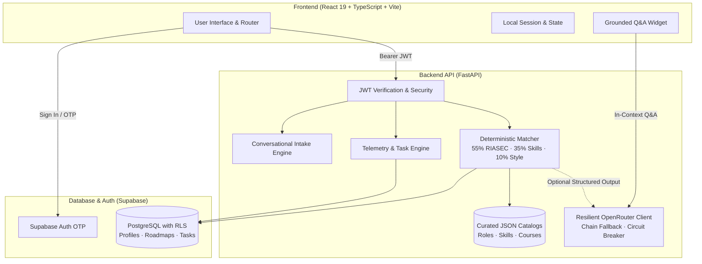

# Pathfinder

<p align="center">
  <strong>Personalized Career-Path Mapping & Milestone-Based Learning Roadmaps for Tech Learners</strong>
</p>

<p align="center">
  <a href="https://github.com/Varunsai1930/pathfinder/actions/workflows/ci.yml">
    
  </a>
  
  
  
  
  
  
  
</p>

---

## Overview

**Pathfinder** is an end-to-end web platform designed to help tech students and career changers navigate entry-level technology roles. Instead of opaque, hallucination-prone AI recommendations, Pathfinder pairs **deterministic, evidence-based matching** with **constrained, grounded LLM personalization**.

Learners can describe their ambitions in natural language or complete a structured assessment across interests, skills, and constraints. Pathfinder calculates transparent fit scores across six technology tracks, pinpoints exact skill gaps, and generates structured, milestone-driven learning roadmaps with built-in task tracking and pacing telemetry.

### Supported Career Tracks

| Role | Core Focus |
| :--- | :--- |
| **Frontend Developer** | Modern web interfaces, component architecture, CSS mastery, state management |
| **Backend Developer** | Distributed APIs, databases, authentication, systems design, performance |
| **Data Analyst** | Exploratory analysis, SQL, visualization, data modeling, business metrics |
| **Cloud / DevOps Engineer** | Cloud infrastructure, CI/CD pipelines, containerization, observability |
| **Security Analyst** | Vulnerability assessment, network security, threat modeling, compliance |
| **Data Engineer** | Data pipelines, ETL/ELT workflows, data warehousing, distributed systems |

---

## Key Features

- 💬 **Conversational Goal Intake**: Describe career goals in plain words; Pathfinder extracts assessment hints to jumpstart the profile.
- 🎯 **Transparent Fit Scoring**: 3-part matching algorithm (55% RIASEC interest alignment, 35% skill confidence readiness, 10% work-style compatibility).
- 🗺️ **Actionable Milestone Roadmaps**: 5-phase progressive curriculum with concrete tasks, project deliverables, and curated learning resources.
- ⏱️ **Task & Telemetry Feedback**: Track completion, study time (`time_spent_minutes`), and comprehension quiz scores (`quiz_score`) with adaptive pacing suggestions.
- 🛡️ **Guaranteed Deterministic Fallback**: The entire application is fully functional offline and without LLM API keys. When enabled, OpenRouter provides grounded narrative explanations backed by a multi-model fallback chain and circuit breaker.
- 🔒 **Row-Level Security**: User authentication via Supabase OTP with verified JWT enforcement on all personal API routes.

---

## System Architecture



---

## Repository Layout

```text
pathfinder/
├── frontend/             # React 19 + Vite + TypeScript application
│   ├── src/              # UI components, state, router, and design tokens
│   ├── e2e/              # Playwright end-to-end test suite
│   └── package.json      # Frontend scripts & dependencies
├── backend/              # FastAPI application & matching engine
│   ├── app/              # API routes, business logic, catalogs, and stores
│   ├── tests/            # Pytest test suite (155+ tests)
│   └── pyproject.toml    # Python dependencies, Ruff, & Pytest configs
├── supabase/             # Database migrations & PostgreSQL RLS policies
│   └── migrations/       # Versioned SQL migrations (schema, tables, indexes)
├── .github/              # Automation & CI/CD workflows
│   └── workflows/ci.yml  # GitHub Actions (ruff, pytest, eslint, vitest, playwright)
├── Makefile              # Unified developer CLI commands
├── CONTRIBUTING.md       # Open-source contribution guidelines
└── LICENSE               # MIT License
```

---

## Getting Started

### Prerequisites

- **Python**: 3.11 or newer
- **Node.js**: 20.x or newer (npm)
- **Supabase Account**: Free project for PostgreSQL + Auth (optional for unit tests; backend includes in-memory fallbacks)

### Quickstart with Makefile

Run from the repository root:

```bash
# 1. Initialize environment files (.env and .env.local) from templates
make setup

# 2. Run backend test suite
make backend-test

# 3. Run frontend test suite
make frontend-test
```

---

### Manual Setup

#### 1. Database Migrations (Supabase)

In your Supabase project's **SQL Editor**, execute the migration files in numerical sequence:

1. `supabase/migrations/20260813000000_initial_schema.sql`
2. `supabase/migrations/20260816000000_roadmaps.sql`
3. `supabase/migrations/20260816010000_tasks.sql`
4. `supabase/migrations/20260820000000_llm_personalization.sql`
5. `supabase/migrations/20260822000000_task_telemetry.sql`
6. `supabase/migrations/20260823000000_profile_goal_text.sql`
7. `supabase/migrations/20260831000000_recommendations_unique.sql`
8. `supabase/migrations/20260831044845_career_certainty.sql`

*Enable **Email OTP** under Authentication → Providers → Email in your Supabase dashboard.*

#### 2. Backend Setup

```bash
cd backend
python3 -m venv .venv
source .venv/bin/activate
pip install -e '.[dev]'
cp .env.example .env
```

Configure `backend/.env`:

```ini
SUPABASE_URL=https://your-project.supabase.co
SUPABASE_ANON_KEY=your-supabase-anon-key
SUPABASE_SERVICE_ROLE_KEY=your-supabase-service-role-key
PATHFINDER_CORS_ORIGINS=http://localhost:5173

# Optional: OpenRouter API key for grounded narrative explanations
OPENROUTER_API_KEY=
```

Start the API server:

```bash
uvicorn app.main:app --reload --port 8000
```

- Health Check: `http://localhost:8000/health`
- Interactive Swagger Docs: `http://localhost:8000/docs`

#### 3. Frontend Setup

```bash
cd frontend
npm install
cp .env.example .env.local
```

Configure `frontend/.env.local`:

```ini
VITE_API_URL=http://localhost:8000
VITE_SUPABASE_URL=https://your-project.supabase.co
VITE_SUPABASE_ANON_KEY=your-supabase-anon-key
```

Start the Vite development server:

```bash
npm run dev
```

Visit **http://localhost:5173** in your browser.

---

## API Reference

All `/api/v1/*` endpoints (except public catalog and health routes) require a Supabase JWT header: `Authorization: Bearer <token>`. User identification is derived strictly from the validated token claims.

| Method | Endpoint | Description | Auth Required |
| :--- | :--- | :--- | :---: |
| `GET` | `/health` | Service health and database connectivity probe | No |
| `GET` | `/api/v1/catalog/roles` | Public catalog of 6 supported tech roles | No |
| `GET` | `/api/v1/catalog/assessment`| Assessment questions, skills, and taxonomy | No |
| `GET` | `/api/v1/catalog/courses` | Recommended course and learning resource list | No |
| `POST` | `/api/v1/intake` | Extracts assessment hints from free-text goal input | Yes |
| `POST` | `/api/v1/profile` | Saves learner assessment answers and constraints | Yes |
| `GET` | `/api/v1/profile` | Retrieves current authenticated user's profile | Yes |
| `POST` | `/api/v1/match` | Computes & persists ranked fit scores for all 6 roles | Yes |
| `GET` | `/api/v1/match` | Returns persisted match results for current profile | Yes |
| `POST` | `/api/v1/roadmaps/{role_id}` | Generates or refreshes roadmap for chosen role | Yes |
| `GET` | `/api/v1/roadmaps/{role_id}` | Retrieves roadmap milestones, tasks, and status | Yes |
| `PATCH`| `/api/v1/tasks/{task_id}` | Updates task completion, study time, and quiz score | Yes |
| `POST` | `/api/v1/questions` | Contextual Q&A on match results and roadmap | Yes |

---

## Testing & Quality Assurance

Pathfinder maintains strict quality, linting, and testing standards across both backend and frontend codebases.

### Backend Tests
```bash
cd backend
pytest                    # Runs 155+ unit & integration tests
ruff check app tests      # Code quality & formatting
```

### Frontend Tests
```bash
cd frontend
npm run lint              # ESLint checks
npm run test              # Vitest unit & component tests
npm run build             # Production TypeScript check & bundle build
npm run e2e               # Playwright end-to-end integration tests
```

### CI Pipeline
Every push and pull request triggers `.github/workflows/ci.yml`, running Ruff, Pytest, ESLint, Vitest, TypeScript build verification, and Playwright end-to-end tests across isolated runners.

---

## Deployment

- **Frontend**: Ready for one-click hosting on [Vercel](https://vercel.com) using `frontend/vercel.json`.
- **Backend**: Container-ready for [Railway](https://railway.app) using `backend/railway.toml` or any Docker/Procfile runtime.
- **Production CORS**: Update `PATHFINDER_CORS_ORIGINS` in production to allow only your production frontend domain.

---

## Contributing

We welcome contributions! Please review [CONTRIBUTING.md](CONTRIBUTING.md) for local setup instructions, code standards, and PR guidelines.

---

## License

This project is licensed under the [MIT License](LICENSE).
